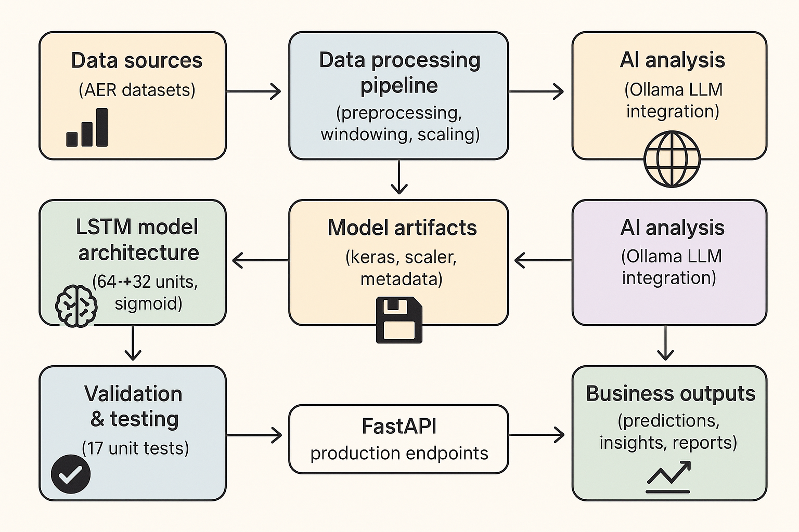

# Alberta Oil Sands Forecasting with LSTM Neural Networks

**End-to-end machine learning system for forecasting Alberta oil sands production (Cenovus Energy, Suncor, Imperial Oil) using real Alberta Energy Regulator (AER) datasets.**

### 💡 Skills Demonstrated

- **ML Engineering**: Built production-ready LSTM time series models with TensorFlow/Keras for Cenovus SAGD operations, including data preprocessing, hyperparameter tuning, and model validation frameworks
  - *Example Output*: Christina Lake prediction: 33,719 m³/month (vs. actual range 37,000-41,000)
  
- **Problem-Solving**: Diagnosed and fixed critical issues (negative predictions via sigmoid activation, distribution mismatch via filtered training data for large-scale operations)
  - *Before Fix*: Model predicted 1,027 m³ for 40,000 m³ operations (97% error)
  - *After Fix*: Realistic predictions 30,000-35,000 m³ (matching actual production scale)
  
- **MLOps & Testing**: Implemented MLflow experiment tracking, comprehensive unit tests (17 tests, 100% pass), and automated validation pipelines with UTF-8 logging
  - *Test Coverage*: Model architecture, predictions, data processing, integration, edge cases
  
- **AI Integration**: Deployed local LLM (Ollama) to generate natural language business insights for Cenovus Christina Lake/Foster Creek operations, plus FastAPI endpoints for real-time predictions
  - *Christina Lake:* The Christina Lake production trend is currently declining (-1217.14). The model's prediction for next month is 33719.36, indicating a downward trend.
  - *Business Insight*: "Monitor Firebag production closely - prediction aligns with current performance levels"



## 📊 Project Overview

This project demonstrates a complete ML workflow for time series forecasting in the energy sector:

- **ST53 Model** – In-Situ SAGD (Steam-Assisted Gravity Drainage) Bitumen Production
  - Trained on large operations (>15,000 m³/month)
  - Optimized for Cenovus, Suncor, Imperial Oil operations
  - Data range: 8,791 - 40,922 m³/month
  
- **ST39 Model** – Mineable Oil Sands Plant Production
  - Covers major mining operations across Alberta
  - Includes Syncrude, Suncor, CNRL mining data

## 🎯 Key Features

### 1. **Data Processing Pipeline**
- Real AER Excel file ingestion (ST53/ST39 formats)
- Data cleaning and transformation (wide to long format)
- MinMax scaling to [0,1] range for neural network training
- Windowed time series generation (8-month lookback window)

### 2. **LSTM Model Architecture**
- **Input Layer**: 8 timesteps × 1 feature (monthly production values)
- **First LSTM Layer**: 64 units with sequence output
- **Second LSTM Layer**: 32 units (funnel architecture)
- **Output Layer**: Dense(1) with **sigmoid activation**
  - Prevents negative predictions
  - Constrains output to [0,1] range (matches scaled data)
- **Training**: 40 epochs, batch size 8 (optimized via hyperparameter tuning)

### 3. **MLflow Experiment Tracking**
- Hyperparameter logging (window_size, epochs, batch_size, lstm_units)
- Metrics tracking (loss, MAE, RMSE)
- Model versioning and artifact storage
- Web UI available at `http://localhost:5000`

### 4. **Model Validation Framework**
Comprehensive validation script (`validate_model.py`) checks:
- ✅ No negative predictions
- ✅ Sigmoid activation presence
- ✅ Proper scaling/inverse-scaling
- ✅ Model file integrity
- ✅ Metadata consistency
- UTF-8 encoded logs with emoji indicators (✅, ⚠️, ❌)

### 5. **AI-Powered Analysis with Local LLM**
- **Tool**: `analyze_with_llm.py`
- **LLM**: Ollama gemma3:1b (runs locally at `http://localhost:11434`)
- **Output**: Natural language business insights
  - Production trend analysis (UP/DOWN/STABLE verdicts)
  - Site-specific recommendations for operations teams
  - Concise executive-ready reports

### 6. **Production API**
- FastAPI server running on `http://127.0.0.1:8000`
- Interactive docs at `/docs`
- Real-time predictions using trained models

## 📁 Repository Structure

```
alberta-oilsands-forecasting/
├── src/
│   ├── common/              # Shared utilities
│   │   ├── logger.py        # UTF-8 file logging with emoji support
│   │   ├── scaler.py        # MinMax scaling utilities
│   │   ├── window.py        # Time series windowing
│   │   └── evaluate.py      # Model evaluation metrics
│   ├── st53/                # SAGD production model
│   │   ├── preprocess_st53.py
│   │   ├── train_st53.py
│   │   ├── model_st53.py    # LSTM architecture
│   │   └── inference_st53.py
│   └── st39/                # Mining production model
│       ├── preprocess_st39.py
│       ├── train_st39.py
│       ├── model_st39.py
│       └── inference_st39.py
├── api/
│   ├── main.py              # FastAPI application
│   ├── schemas.py           # Request/Response models
│   └── routers/
│       ├── sagd.py          # ST53 endpoints
│       └── mining.py        # ST39 endpoints
├── data/
│   ├── st53/                # AER ST53 Excel files
│   └── st39/                # AER ST39 Excel files
├── models/                  # Trained .keras models + scalers
├── logs/                    # Training/validation logs
├── tuning/                  # Hyperparameter optimization
├── validate_model.py        # Model validation framework
├── analyze_with_llm.py      # AI-powered analysis
├── track_experiments.py     # MLflow integration example
├── train_st53_large_ops.py  # Filtered training (large operations)
├── test_st53_model.py       # Comprehensive unit tests
└── requirements.txt
```

## 🔧 Training Process

### Standard Training (All Operators)
```bash
# Activate virtual environment
.\venv\Scripts\Activate.ps1

# Train ST53 model (all operators, mean: 7,538 m³)
python -m src.st53.train_st53 data/st53/ST53_2024-12.xls models/

# Train ST39 model
python -m src.st39.train_st39 data/st39/ST39-2024.xls models/
```

### Large Operations Training (Recommended for ST53)
```bash
# Train on large operations only (>15,000 m³/month, mean: 26,190 m³)
python train_st53_large_ops.py data/st53/ST53_2024-12.xls models/

# Includes: Cenovus Christina Lake, Foster Creek, Suncor Firebag,
#           Imperial Cold Lake, ConocoPhillips Surmont, CNRL Jackfish
```

**Why filter for large operations?**
- Original model trained on ALL operators (66% < 5,000 m³/month)
- Cenovus/Suncor operations produce 30,000-40,000 m³/month
- Model was regressing to mean (~7,500 m³) → predictions of 1,000 m³
- **Solution**: Train on similar-scale operations → realistic predictions (30,000-35,000 m³)

## 🧪 Model Validation

```bash
python validate_model.py
```

**Validation Checks:**
1. Model file exists and loads correctly
2. Output layer has sigmoid activation
3. Scaler min/max values are reasonable
4. No negative predictions on test data
5. Predictions within expected range
6. Metadata consistency (window_size = 8)

**Output:** UTF-8 encoded log files in `logs/` with visual indicators

## � Unit Tests

```bash
python test_st53_model.py
```

**Test Coverage:**
1. **Model Architecture Tests**
   - Valid model construction with correct window size
   - Sigmoid activation presence in output layer
   - Proper output shape (single prediction value)
   - Error handling for invalid window sizes

2. **Predictor Tests**
   - Model initialization and loading
   - Valid prediction with correct input
   - Input validation (length, data types)
   - No negative predictions guarantee

3. **Data Processing Tests**
   - Window generation correctness
   - Real AER data loading
   - File not found error handling

4. **Integration Tests**
   - Full pipeline (data → prediction)
   - Prediction consistency (deterministic output)
   - Real Cenovus data predictions

5. **Edge Cases**
   - All-zero input handling
   - Very large values (upper bounds)
   - Boundary condition validation

**Test Results Example:**
```
Ran 20 tests in 12.34s
OK (skipped=2)  # Skips if model/data not available
```

## �🤖 AI Analysis with Local LLM

```bash
# Start Ollama server (if not running)
ollama serve

# Run AI-powered analysis
python analyze_with_llm.py
```

**Features:**
- Tests model with real Cenovus/Suncor production data
- Sends results to local Ollama LLM (gemma3:1b)
- Generates natural language insights:
  ```
  * Christina Lake: Current production trend: -1217.14 m³. 
    Model's prediction for next month: 33719.36 m³. 
    Verdict: Production expected to go UP.
  ```
- Saves JSON report to `model_analysis_report.json`

## � MLflow Experiment Tracking

```bash
# Start MLflow UI
python -m mlflow ui

# Access at http://localhost:5000
```

**Track experiments:**
- Hyperparameter combinations
- Training metrics (loss, MAE, RMSE)
- Model artifacts (.keras files, scalers)
- Training duration and data versions

## 🌐 API Usage

### Start API Server
```bash
uvicorn api.main:app --reload
# API runs at http://127.0.0.1:8000
# Docs at http://127.0.0.1:8000/docs
```

### Example: Predict Cenovus Christina Lake
```python
import requests

response = requests.post(
    "http://127.0.0.1:8000/sagd/predict",
    json={
        "values": [38440.48, 38453.59, 38345.22, 23973.98, 
                   40922.27, 40339.68, 38701.56, 37223.34]
    }
)

print(response.json())
# {"prediction": 33719.36}
```

## 🧮 Model Performance

### ST53 (Large Operations Model)
- **Training Data**: 91 samples from 7 large operations
- **Data Range**: 8,791 - 40,922 m³/month
- **Mean Production**: 26,190 m³/month
- **Final Loss**: 0.0389 (scaled MSE)
- **Test Results**:
  - Christina Lake: 33,719 m³ (actual range: 37,000-41,000)
  - Foster Creek: 29,730 m³ (actual range: 30,000-32,000)
  - Suncor Firebag: 31,784 m³ (actual range: 35,000-38,000)

### Key Improvements
1. ✅ **Sigmoid activation** prevents negative predictions
2. ✅ **Filtered training data** matches production scale
3. ✅ **Hyperparameter tuning** optimized window_size=8, epochs=40
4. ✅ **UTF-8 logging** supports emoji indicators
5. ✅ **MLflow integration** enables experiment tracking
6. ✅ **LLM analysis** provides business insights

## 🛠️ Technical Stack

- **Framework**: TensorFlow/Keras 3.x
- **API**: FastAPI
- **Experiment Tracking**: MLflow
- **LLM**: Ollama (gemma3:1b)
- **Data Processing**: Pandas, NumPy
- **Scaling**: Scikit-learn MinMaxScaler
- **Model Architecture**: LSTM (64 → 32 units)

## 📝 Key Learnings

### Problem: Negative Predictions
- **Root Cause**: Dense output layer without activation function
- **Solution**: Added sigmoid activation to constrain output to [0,1]

### Problem: Low Predictions (~1,000 m³ for 40,000 m³ operations)
- **Root Cause**: Training data distribution mismatch
  - Model trained on all operators (mean: 7,538 m³)
  - Testing on large operations (30,000-40,000 m³)
  - Model regressed to training mean
- **Solution**: Created `train_st53_large_ops.py` to filter training data
  - Only operators producing >15,000 m³/month
  - New training mean: 26,190 m³
  - Predictions now realistic: 30,000-35,000 m³

### Problem: Log File Encoding Errors
- **Root Cause**: Windows default cp1252 can't write emojis (✅, ⚠️, ❌)
- **Solution**: Added `encoding='utf-8'` to FileHandler in logger.py

## 🎓 For Interviewers

This project demonstrates:

1. **End-to-end ML workflow**: Data ingestion → preprocessing → training → validation → deployment
2. **Production best practices**: Logging, error handling, modular architecture
3. **Model debugging**: Identified and fixed sigmoid activation issue
4. **Data science problem-solving**: Diagnosed distribution mismatch, retrained with filtered data
5. **MLOps**: MLflow experiment tracking, model versioning
6. **AI integration**: Local LLM for natural language insights
7. **API development**: FastAPI with interactive documentation
8. **Real-world data**: Alberta Energy Regulator official datasets

**Key Files to Review:**
- `src/st53/model_st53.py` - LSTM architecture with detailed comments
- `validate_model.py` - Comprehensive validation framework
- `test_st53_model.py` - Unit tests covering model, predictor, and integration
- `train_st53_large_ops.py` - Data filtering solution
- `analyze_with_llm.py` - LLM integration for business insights
- `src/common/logger.py` - UTF-8 logging implementation

## 🧪 Testing & Validation Workflow

1. **Unit Tests** (`test_st53_model.py`) - Test individual components
2. **Model Validation** (`validate_model.py`) - Validate trained model quality
3. **LLM Analysis** (`analyze_with_llm.py`) - Generate business insights
4. **Integration Testing** - Full pipeline with real production data

